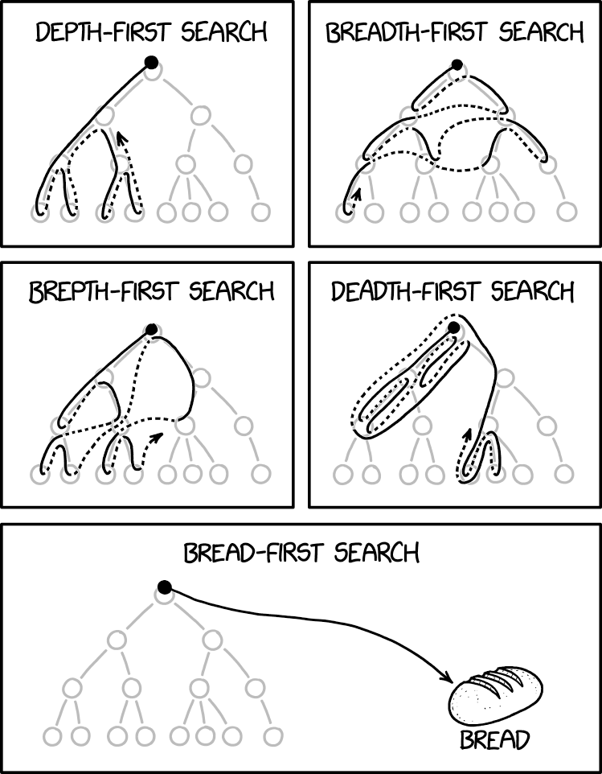

# Exercise 11.3 - ✈️ Tree Traversal

## 🎯 Objectives

- **Implement** tree traversal functions recursively in Java.

## 🔨 Setup

1. Clone the repo (or download the zip) for this exercise, which you can find [here](https://github.com/JAC-CS-Programming-4-W23/E11.3-Tree-Traversal).
2. Start IntelliJ, go to `File -> Open...`, and select the cloned/downloaded folder.
3. If at the top it says "Project JDK is not defined", click "Setup JDK" on the top right, and select the JDK version you have installed on your machine.

    

4. To get the unit tests to work, open `TreeSetTest.java` and add JUnit to the classpath:

    

    - Just click "OK" on the resulting dialogue window and all the test-related red squigglies should disappear.

## 🔍 Context

In this exercise, you will be traversing trees to print song lyrics. Each word of the lyric is a node in the tree.

To visit each node in a tree, we can use one of three traversal strategies:

1. Pre-order traversal
2. Post-order traversal
3. In-order traversal

For example, given this lyric tree:

```text
     row1
    /     \
  row2     boat
  /  \
row3  your
```

the traversal method that would print the lyrics in the correct order would be a **pre-order traversal**:

1. Visit the current node.
2. Pre-order visit the left subtree.
3. Pre-order visit the right subtree.

For this lyric tree:

```text
     boat
    /    \
  row3    your
  /  \
row1  row2
```

the traversal method that would print the lyrics in the correct order would be a **post-order traversal**:

1. Pre-order visit the left subtree.
2. Pre-order visit the right subtree.
3. Visit the current node.

For this lyric tree:

```text
     your
    /    \
  row2    boat
  /  \
row1  row3
```

the traversal method that would print the lyrics in the correct order would be a **in-order traversal**:

1. Pre-order visit the left subtree.
2. Visit the current node.
3. Pre-order visit the right subtree.

## 🚦 Let's Go

### Traversal

- You will find 3 functions inside `TreeSet.java` to implement the 3 different traversal functions.
- They all take the same arguments, but will be implemented differently.
- The objective is to add elements to the list parameter which should be passed in during each recursive call.
- Use the tests to run your code. You'll know if you're correct if the song lyrics get printed out in the correct order.

### Pretty Print

- You will find 4 functions inside `TreeSet.java`. 3 of them are for pre, post, and in order traversals.
  - They all take the same arguments, but will be implemented differently.
  - The `depth` parameter can be used to keep track of which level of the tree the current recursive call is on.
  - The `prefix` parameter can be used to denote whether we're currently in a left or right subtree by passing in `"L: "` or `"R: "` as the prefix.
- The last one is a challenge to print out the tree in a more tree-like format.
  - Note that for this one, you do not have to use recursion.
  - You can use a breadth-first traversal to first add all the elements to a list.
  - Using the list, you can print out the elements using the fact that the first "row" will only have 1 element, the second row will have 2, the third will have 3, etc. In other words, every $n^{th}$ row will have $2^n$ elements printed.

---

 [^1]

[^1]:https://xkcd.com/2407/
